Requests for read operations from the data blocks residing in the following cylinders are given below. Analyze the `Shortest Seek Time First` and `C-SCAN` disk scheduling algorithms in terms of the total amount of seek time and comment on the algorithm you may like to choose. Draw the figures of the cylinder movements.

Cylinder Requests: 122 26 113 13 22 109 180 70 37 162 142 29 10 310 79 210 121 32 13

Use the following data wherever applicable.

i.	Track to next track disk-head placement time:`1.25` ms.

ii.	There are 400 tracks in the disk (Starting track number is: 0) 

Iii.	The disk head is currently positioned over cylinder: 101.

Iv.	The disk head is moving towards the higher-numbered cylinders

V. 	The disk head services disk blocks only when moving towards higher-numbered cylinders.  [ Decipher ]

Answer:

```
122 26 113 13 22 109 180 70 37 162 142 29 10 310 79 210 121 32 13
0 10 11 13 22 26 29 32 37 70 79 109 113 121 122 142 162 180 210 310

Current head is 101

Moving towards higher numbered cylinders

Gives service only when moving towards higher numbered cylinders
```
## SSTF (Shortest Seek Time First)

```mermaid

graph LR

101 --> | 109 - 101 = 8 | 109

109 --> | 109 - 113 = 4 | 113

113 --> | 113 - 121 = 8 | 121

121 --> | 121 - 122 = 1 | 122

122 --> | 122 - 142 = 20 | 142

142 --> | 142 - 162 = 20 | 162

162 --> | 162 - 180 = 18 | 180

180 --> | 180 - 210 = 30 | 210

210 --> | 210 - 310 = 100 | 310

310 --> |310 - 79 = 231| 79

79 --> |79 - 70 = 9| 70

70 --> |70 - 37 = 33| 37

37 --> |37 - 32 = 5| 32

32 --> |32 - 29 = 3| 29

29 --> |29 - 26 = 3| 26

26 --> |26 - 22 = 4| 22

22 --> |22 - 13 = 9| 13

13 --> |13 - 11 = 2| 11

11 --> |11 - 10 = 1| 10


```



Total head movement = (109 - 101) + (113 - 109 ) + (121 - 113) + (122 - 121) + (142 - 122) + (162 - 142) + (180 - 162) + (210 - 180) + (310 - 210) + (310 - 79) + (79 - 70) + (70 - 37) + (37 - 32) + (32 - 29) + (29 - 26) + (26 - 22) + (22 - 13) + (13 - 11) + (11 - 10) 

= 8 + 4 + 8 + 1 + 20 + 20 + 18 + 30 + 100 + 231 + 9 + 33 + 5 + 3 + 3 + 4 + 9 + 2 + 1

= 509

## C-SCAN

```mermaid

graph LR

101 --> | 109 - 101 = 8 | 109

109 --> | 109 - 113 = 4 | 113

113 --> | 113 - 121 = 8 | 121

121 --> | 121 - 122 = 1 | 122

122 --> | 122 - 142 = 20 | 142

142 --> | 142 - 162 = 20 | 162

162 --> | 162 - 180 = 18 | 180

180 --> | 180 - 210 = 30 | 210

210 --> | 210 - 310 = 100 | 310

310 --> |310 - 399 = 89| 399

399 --> |399 - 0 = 0 | 0

0 --> |0 - 10 = 10| 10

10 --> |10 - 11 = 1| 11

11 --> |11 - 13 = 2| 13

13 --> |13 - 22 = 9| 22

22 --> |22 - 26 = 4| 26

26 --> |26 - 29 = 3| 29

29 --> |29 - 32 = 3| 32

32 --> |32 - 37 = 5| 37

37 --> |37 - 70 = 33| 70

70 --> |70 - 79 = 9| 79
```



Total head movement = (109 - 101) + (113 - 109 ) + (121 - 113) + (122 - 121) + (142 - 122) + (162 - 142) + (180 - 162) + (210 - 180) + (310 - 210) + (310 - 399) + (399 - 0) + (0 - 10) + (10 - 11) + (11 - 13) + (13 - 22) + (22 - 26) + (26 - 29) + (29 - 32) + (32 - 37) + (37 - 70) + (70 - 79)

= 8 + 4 + 8 + 1 + 20 + 20 + 18 + 30 + 100 + 89 + 0 + 10 + 1 + 2 + 9 + 4 + 3 + 3 + 5 + 33 + 9

= 377

Summary:

SSTF = 509

C-SCAN = 377

C-SCAN is better


