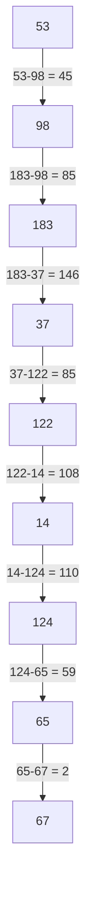
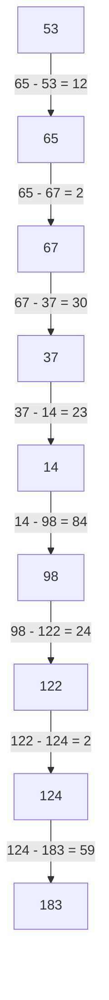
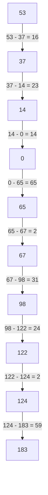
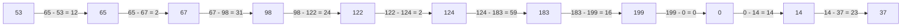
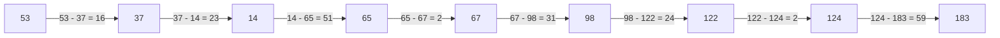
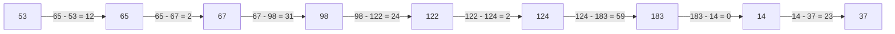

#
Queue 98 183 37 122 14 124 65 67
Current head position = 53

Summary of the algorithms

Algorithm | Working procedure
--- | ---
FCFS | First come first serve
SSTF | Shortest seek time first
SCAN | Move to the end of the disk and then move to the other end of the disk and process the request
C-SCAN | Move to the end of the disk and then move to the other end of the disk and process the request in the same direction always
LOOK | Same as scan but will go to the last request in the direction of the head
C-LOOK | Same as c-scan but will go to the last request in the direction of the head


## FCFS (First Come First Serve)
Here the first cylinder request will be processed at first 



Total head movement = 45 + 85 + 146 + 85 + 108 + 110 + 59 + 2  = 640

## SSTF (Shortest Seek Time First)

Here the shortest seek time will be processed at first 

so sorting the request


14 37 65 67 98 122 124 183

Current head is 53

0 14 37 53 65 67 98 122 124 183 199





Total head movement = 12 + 2 + 30 + 23 + 84 + 24 + 2 + 59 = 236

## SCAN

Here the head will move to the end of the disk and then it will move to the other end of the disk and process the request

Here the direction of the head is important and it will be given in the question

In this case lets assume head is moving to to 0

```
98 183 37 122 14 124 65 67

0 14 37 53 65 67 98 122 124 183 199
```




Total head movement = 16 + 23 + 14 + 65 + 2 + 31 + 24 + 2 + 59 = 236

## C-SCAN

Here the head will move to the end of the disk and then it will move to the other end of the disk and process the request in the same direction always

Here the service direction will be given 

```
98 183 37 122 14 124 65 67

0 14 37 53 65 67 98 122 124 183 199
```



Total head movement = 12 + 2 + 31 + 24 + 2 + 59 + 16 + 0 + 14 + 23 = 183

## LOOK

It is same as scan but it will not go to the end of the disk but rather it will go to the last request in the direction of the head



Total head movement = 16 + 23 + 51 + 2 + 31 + 24 + 2 + 59 = 208


## C-LOOK

Almost same as c-scan but will not go to the end of the disk




Total head movement = 12 + 2 + 31 + 24 + 2 + 59 + 0 + 23 = 153


